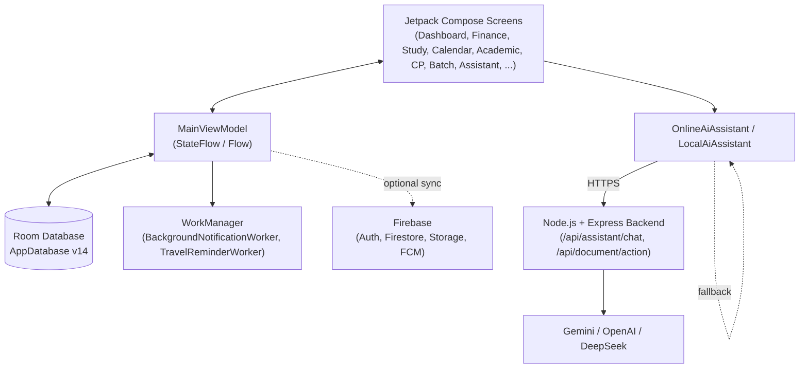

# Smart Life Manager

**An all-in-one Android productivity companion for students** — unifying personal finance tracking, study management, class scheduling, habit building, competitive-programming progress, and an AI study assistant into a single offline-first app.

<p>
  
  
  
  
  
  
  
  
</p>

---

## Overview

**Smart Life Manager** is a native Android application built with **Kotlin** and **Jetpack Compose** that helps students manage the many moving parts of academic life — money, study time, class routines, tasks, habits, and competitive-programming practice — from one dashboard.

The app is **offline-first**: all data is persisted locally with a **Room** database, so every feature works without an internet connection. On top of that local core, it optionally layers **Firebase** (Authentication, Firestore, Cloud Storage, Cloud Messaging) for account sign-in and cloud backup, and a lightweight **Node.js/Express** backend that proxies requests to Gemini, OpenAI, or DeepSeek so the in-app AI Assistant can answer questions using the user's own real data — without ever shipping an AI provider key inside the APK.

It was built as a Computer Science & Engineering coursework/portfolio project, with an emphasis on a broad, realistic feature set rather than a single narrow use case.

---

## Key Features

### Personal Finance
- Log expenses with amount, category, subcategory, payment method (Cash / Card / Mobile Banking), ledger, note, and an optional receipt image
- Recurring expenses with configurable frequency and next-due tracking
- Monthly and per-category budgets with progress tracking
- Savings goals with target amount, saved amount, and deadline

### Study Management
- Study sessions with subject, course code, duration, and notes
- Course-level tracking with topics, progress percentage, and exam dates
- Rich text study notes per course, with optional attached PDF
- Spaced-repetition style flashcards with a "next review date" and mastered flag
- Daily study goals with an auto-divided session breakdown

### Focus Timer
- Built-in Pomodoro-style timer with **Focus (25 min)**, **Short break (5 min)**, and **Long break (15 min)** modes
- Automatically logs completed focus sessions as study sessions and cycles through break/focus rounds based on a configurable session target

### Class Routine, Calendar & Academic Tracking
- Weekly class routine (course, teacher, room, day, time)
- Semester-based academic module: courses, class schedule, exams (with room/seat/syllabus/preparation progress), and academic events
- Unified calendar view that merges classes, routines, tasks, and daily reports

### Tasks & Habits
- Task list with description, deadline, priority (High/Medium/Low), category, and optional reminders
- Habit tracker with daily completion history, streak calculation, and per-habit reminder time

### Competitive Programming (CP) Tracker
- Log solved problems per platform (contest, rating, difficulty, topic, attempts, editorial link, upsolved flag)
- Weekly/monthly targets per platform, with week-over-week topic-strength insights surfaced by the AI Assistant

### Dashboard, Reports & Analytics
- Home dashboard summarizing today's expenses, study time, tasks, and classes
- Daily, weekly, and monthly generated reports (productivity score, goal completion %, task completion %, category spend)
- Analytics screen with weekly productivity and expense-trend charts

### AI Study Assistant
- Chat-based assistant that answers questions about the user's own expenses, study time, tasks, classes, CP progress, and upcoming exams
- Supports **Gemini**, **OpenAI**, and **DeepSeek** as remote providers (selectable per request) plus a fully offline **Local/Offline AI** fallback (Bengali/English rule-based responses) that activates automatically if the backend or network is unavailable
- Document actions (summarize, extract key points, generate flashcards, generate an MCQ quiz, build a study plan, explain, answer questions) that operate on text extracted from uploaded documents
- The Android app never contains provider API keys — only the selected provider ID and contextual data are sent to the self-hosted backend, which holds the actual keys

### Batch Sync (Class Representative Tools)
- Maintain a student contact list and recipient groups
- Compose and publish batch announcements (class updates, exam notices, events) with a title, type, course code, date/time, and target audience
- **In-App** delivery channel is fully implemented (creates real in-app notifications for recipients); **WhatsApp** and **Messenger** channels are wired into the delivery pipeline but currently report `Failed` / "not available through the configured official messaging channel", since no external messaging integration is configured
- Delivery history with per-recipient, per-channel attempt status

### Documents
- Import documents (with extracted text) and feed them into the AI Assistant's document actions

### Travel Reminders
- Store trip details (transport type, service, seat/coach, booking reference, ticket image) and receive a scheduled notification ahead of departure

### Notifications
- In-app notification center backed by Room, plus system notifications for classes, study reminders, morning briefings, and travel reminders, scheduled via **WorkManager**
- Runtime `POST_NOTIFICATIONS` permission request on Android 13+

### Account & Cloud Sync (Firebase)
- Email/password and Google sign-in via Firebase Authentication
- User profile and FCM token stored in Firestore
- File uploads (e.g., receipts, tickets) to Firebase Cloud Storage
- Push notifications via Firebase Cloud Messaging
- Falls back gracefully to local-only Room storage when `google-services.json` is not present

### Profile & Settings
- Configurable username, currency symbol (defaults to **৳**), monthly budget, dark mode (System/Light/Dark), app lock with PIN, reminder toggles, cloud sync toggle, and a class-representative flag that unlocks the Batch Sync tools

---

## Tech Stack

| Technology | Purpose |
|---|---|
| Kotlin | Primary application language (Android) |
| Jetpack Compose (Material 3) | Declarative UI toolkit |
| Room (`2.6.1`) | Local SQLite persistence layer |
| WorkManager (`2.10.0`) | Scheduled background notifications (classes, study, travel) |
| Kotlin Coroutines / Flow | Asynchronous data streams from the ViewModel to the UI |
| Coil | Image loading (receipts, tickets, avatars) |
| Firebase Auth, Firestore, Storage, Messaging (BOM `33.7.0`) | Optional cloud authentication, sync, storage, and push notifications |
| Google Play Services Auth | Google sign-in credential flow |
| Node.js + Express | Backend AI proxy service |
| Gemini / OpenAI / DeepSeek APIs | Remote AI providers called from the backend |
| Android SpeechRecognizer & TextToSpeech | Voice input/output for the AI Assistant |

---

## Architecture

The Android app follows an **MVVM**-style structure with a single shared `MainViewModel` exposing Room data as `Flow`/`StateFlow` to Compose screens, backed by a **Room** database as the local source of truth. AI requests are routed through a thin **repository-like** `OnlineAiAssistant` class that calls the backend and falls back to `LocalAiAssistant` on any failure.



- **Single-activity, state-driven navigation** — `MainActivity` hosts one Compose tree; the active screen is driven by an in-memory `Destination` enum switched from a navigation drawer, bottom bar, and a floating quick-action menu (not `Navigation-Compose` graph-based).
- **Offline-first**: every screen reads/writes Room directly through the ViewModel; Firebase and the AI backend are optional, additive layers.
- **Graceful degradation**: `FirebaseCloudService` no-ops safely without `google-services.json`; `OnlineAiAssistant` automatically falls back to `LocalAiAssistant` if the backend or a provider is unreachable.

---

## Project Structure

```text
Personal_FinanceStudyDaily_Routine_Assistant/
├── app/
│   ├── src/main/
│   │   ├── AndroidManifest.xml
│   │   ├── java/com/example/personal_financestudydaily_routine_assistant/
│   │   │   ├── MainActivity.kt              # App entry point, navigation, dashboard, dialogs
│   │   │   ├── MainViewModel.kt             # Shared ViewModel (Room-backed state)
│   │   │   ├── AcademicScreen.kt
│   │   │   ├── AnalyticsScreen.kt
│   │   │   ├── CalendarScreen.kt / CalendarRoutineUtils.kt
│   │   │   ├── DocumentsScreen.kt
│   │   │   ├── FocusScreen.kt               # Pomodoro timer
│   │   │   ├── HabitTrackerScreen.kt
│   │   │   ├── StudyManagementScreen.kt
│   │   │   ├── SmartBatchBroadcast.kt       # Batch Sync UI panel
│   │   │   ├── BackgroundNotificationWorker.kt
│   │   │   ├── TravelReminderWorker.kt
│   │   │   ├── ai/
│   │   │   │   └── AiAssistant.kt           # Local + Online AI assistant implementations
│   │   │   ├── data/
│   │   │   │   ├── broadcast/BroadcastService.kt
│   │   │   │   ├── cloud/FirebaseCloudService.kt / SmartLifeMessagingService.kt
│   │   │   │   └── database/AppDatabase.kt, Daos.kt, Entities.kt, Converters.kt
│   │   │   ├── domain/calculator/
│   │   │   │   ├── ProductivityCalculator.kt
│   │   │   │   └── SmartTimeCalculator.kt
│   │   │   └── ui/theme/                    # Color.kt, Theme.kt, Type.kt
│   │   └── res/                             # drawables, mipmaps, strings, XML config
│   ├── src/test/                            # Local unit tests
│   ├── src/androidTest/                     # Instrumented tests
│   └── build.gradle.kts
├── backend/
│   ├── src/server.js                        # Express API: /api/assistant/chat, /api/document/action
│   ├── package.json
│   └── .env.example
├── gradle/libs.versions.toml
└── README.md
```

---

## Requirements

- Android Studio (recent stable release, with the Android 35 SDK Platform installed)
- JDK 11 or newer
- Android SDK with **minSdk 24 / targetSdk 35 / compileSdk 35**
- A physical device or emulator running Android 7.0 (API 24) or newer
- Node.js (LTS) — only needed if you want to run the AI backend locally
- Internet connection — only required for AI Assistant remote providers and Firebase features; the rest of the app works fully offline

---

## Installation & Setup

```bash
git clone https://github.com/Sihab75/smart-life-manager.git
cd smart-life-manager
```

1. Open the project root in **Android Studio** and let Gradle sync.
2. *(Optional — AI Assistant remote providers)* Set up the backend — see [Backend / AI API](#-backend--ai-api) below.
3. *(Optional — cloud sync)* Configure Firebase — see [Firebase Setup](#-firebase-setup) below.
4. Build and run the `app` module on an emulator or device (API 24+).

---

## Configuration / Environment Variables

The Android app resolves the AI backend's base URL from a Gradle property at build time:

```kotlin
// app/build.gradle.kts — resolved as BuildConfig.ASSISTANT_BASE_URL
val assistantBaseUrl = providers.gradleProperty("ASSISTANT_BASE_URL")
    .orElse("http://10.0.2.2:3000") // default: Android emulator → localhost:3000
```

Set `ASSISTANT_BASE_URL` in your `gradle.properties` (or as a `-P` flag) to point at your deployed backend's HTTPS URL. For a physical device or a deployed backend, do **not** use `10.0.2.2` — that address only resolves to `localhost` from inside the Android emulator.

The backend itself is configured via a `.env` file (see `backend/.env.example`):

```text
PORT=3000
GEMINI_API_KEY=YOUR_API_KEY
GEMINI_MODEL=gemini-2.5-flash
OPENAI_API_KEY=YOUR_API_KEY
OPENAI_MODEL=gpt-4o-mini
DEEPSEEK_API_KEY=YOUR_API_KEY
DEEPSEEK_MODEL=deepseek-chat
```

You only need to add keys for the providers you plan to enable; the Android app can select any configured provider per request, and the **Local/Offline AI** always works with zero configuration.

---

## Database

The app uses **Room** (`AppDatabase`, schema **version 14**) as its single local source of truth, covering the entire feature set — finance, study, academics, tasks, habits, CP tracking, batch broadcast, travel, notifications, and generated reports. Key entity groups include:

| Domain | Entities |
|---|---|
| Finance | `ExpenseEntity`, `BudgetEntity`, `CategoryEntity`, `SavingsGoalEntity`, `RecurringExpenseEntity` |
| Study | `StudySessionEntity`, `StudyGoalEntity`, `StudyCourseEntity`, `StudyTopicEntity`, `StudyNoteEntity`, `StudyFlashcardEntity` |
| Academics | `ClassEntity`, `AcademicSemesterEntity`, `AcademicCourseEntity`, `AcademicClassEntity`, `AcademicExamEntity`, `AcademicEventEntity` |
| Productivity | `TaskEntity`, `WeeklyGoalEntity`, `DailyRoutineEntity`, `ActivityLogEntity`, `HabitEntity`, `HabitCompletionEntity` |
| Competitive Programming | `CpProblemEntity`, `CpGoalEntity` |
| Batch Sync | `BatchItemEntity`, `StudentContactEntity`, `RecipientGroupEntity`, `BatchAnnouncementEntity`, `AnnouncementRecipientEntity`, `DeliveryAttemptEntity` |
| Reports | `DailyReportEntity`, `WeeklyReportEntity`, `MonthlyReportEntity` |
| Assistant & Misc | `AssistantMessageEntity`, `AssistantConversationEntity`, `DocumentEntity`, `TravelTripEntity`, `NotificationEntity`, `UserSettingsEntity`, `UserEntity` |

Relationships are primarily keyed by `Long` foreign-key-style ID fields (e.g., `StudyTopicEntity.courseId`, `AcademicClassEntity.semesterId`), with a few genuine composite-key join tables (`AnnouncementRecipientEntity`, `HabitCompletionEntity`).

---

## AI Integration

- **Providers**: Gemini (`gemini-2.5-flash` default), OpenAI (`gpt-4o-mini` default), DeepSeek (`deepseek-chat` default), plus an offline rule-based `LocalAiAssistant`.
- **What the AI does**: answers natural-language questions about the user's own expenses, study time, tasks, classes, and CP progress; performs document actions (summarize, key points, flashcards, quiz, study plan, explain, answer) on user-supplied document text.
- **How it interacts**: the Android app calls the self-hosted backend's `POST /api/assistant/chat` and `POST /api/document/action` endpoints over HTTPS with an 8–30s timeout, and automatically falls back to the local offline assistant on any network/provider error.
- **Data sent to the AI provider**: the chat message/document text plus a compact context object — today's/month's expense totals and category breakdown, study minutes, open/total task counts, class count, CP solved counts and weekly topic deltas, upcoming exam titles, and today's schedule. No provider API keys are ever present on the Android side.
- **Configuration**: see [Configuration / Environment Variables](#%EF%B8%8F-configuration--environment-variables).

---

## Backend / AI API

A minimal **Express** server (`backend/src/server.js`) proxies chat and document requests to the configured AI provider, keeping provider keys off the device.

| Method | Endpoint | Purpose |
|---|---|---|
| `GET` | `/health` | Liveness check (`{ ok: true }`) |
| `POST` | `/api/assistant/chat` | Accepts `{ message, context, provider }`, returns `{ reply }` |
| `POST` | `/api/document/action` | Accepts `{ action, title, text, provider }`, returns `{ result }` |

**Local development:**

```bash
cd backend
cp .env.example .env   # then fill in the keys you want to enable
npm install
npm start               # listens on PORT (default 3000)
```

For the Android emulator, the default `http://10.0.2.2:3000` already points at this local server. Deploy the backend to any Node-compatible host for real devices, and point `ASSISTANT_BASE_URL` at its HTTPS URL.

---

## Firebase Setup

The Android app includes Firebase Authentication, Google credential sign-in, Firestore user profiles, Cloud Storage uploads, and Firebase Cloud Messaging token registration. Local Room data remains fully available offline regardless of Firebase configuration.

1. Create an Android app in Firebase with package name `com.example.personal_financestudydaily_routine_assistant`.
2. Enable **Email/Password** and **Google** providers in Firebase Authentication.
3. Create **Firestore** and **Storage**, then add security rules restricting documents/files to the authenticated user's UID.
4. Download `google-services.json` and place it at `app/google-services.json`.
5. Configure the Firebase project's SHA-1 / SHA-256 fingerprints for Google Sign-In.

`FirebaseCloudService` safely reports a configuration error until `google-services.json` is present, so debug builds run before Firebase is configured.

---

## Permissions

| Permission | Reason |
|---|---|
| `INTERNET` | AI backend requests, Firebase Auth/Firestore/Storage/Messaging |
| `RECORD_AUDIO` | Voice input for the AI Assistant (SpeechRecognizer) |
| `POST_NOTIFICATIONS` | Class, study, morning, travel, and batch-sync notifications on Android 13+ |

---

## Testing

The project currently ships with the **default Android Studio project templates**:

- `app/src/test/.../ExampleUnitTest.kt` — a placeholder local unit test
- `app/src/androidTest/.../ExampleInstrumentedTest.kt` — a placeholder instrumented test verifying the application package name

No feature-specific automated test coverage exists yet; verification has been manual.

---

## Build & Run

```bash
# Debug build
./gradlew assembleDebug

# Run unit tests
./gradlew test

# Run instrumented tests (device/emulator required)
./gradlew connectedAndroidTest
```

---

## Known Limitations

- **Batch Sync delivery**: only the **In-App** notification channel actually delivers; **WhatsApp** and **Messenger** channels are wired into `BroadcastService` but always return a `Failed` status, since no real messaging integration is configured.
- **No automated test coverage**: only placeholder template tests are present.
- **Firebase is optional but required for**: cross-device sync, cloud backup of receipts/tickets, and push notifications — the app is fully usable without it, purely on local Room storage.
- **AI Assistant requires backend deployment** for Gemini/OpenAI/DeepSeek responses; without it (or without configured provider keys), the app transparently falls back to the local, rule-based offline assistant.
- **No app store release / signing configuration** is included in this repository.

---

## Roadmap

- [x] Offline-first Room database covering finance, study, academics, tasks, habits, CP tracking, and reports
- [x] Pomodoro-style focus timer integrated with study session logging
- [x] AI Assistant with multi-provider backend and offline fallback
- [x] Firebase Authentication, Firestore sync, Storage uploads, and Cloud Messaging
- [x] Batch Sync in-app announcement delivery
- [ ] Real WhatsApp / Messenger delivery channel integration for Batch Sync
- [ ] Automated unit and instrumentation test coverage
- [ ] App icon/store assets and a public release build

---

## Contributing

1. Fork the repository
2. Create a feature branch (`git checkout -b feature/your-feature`)
3. Make your changes
4. Test the changes locally (`./gradlew test` / manual verification)
5. Commit your changes (`git commit -m "Add your feature"`)
6. Push to the branch (`git push origin feature/your-feature`)
7. Open a Pull Request

---

## License

> No license has been specified yet.

---

## Author

**Md. Korimul Jaman**
GitHub: [@Sihab75](https://github.com/Sihab75)

---

## Acknowledgements

- [Jetpack Compose](https://developer.android.com/jetpack/compose) & [Material 3](https://m3.material.io/) — UI toolkit and design system
- [Room](https://developer.android.com/jetpack/androidx/releases/room) & [WorkManager](https://developer.android.com/jetpack/androidx/releases/work) — local persistence and background scheduling
- [Coil](https://coil-kt.github.io/coil/) — image loading
- [Firebase](https://firebase.google.com/) (Authentication, Firestore, Storage, Cloud Messaging)
- [Express](https://expressjs.com/) — backend AI proxy server
- [Google Gemini](https://ai.google.dev/), [OpenAI](https://openai.com/), and [DeepSeek](https://www.deepseek.com/) APIs — AI Assistant providers